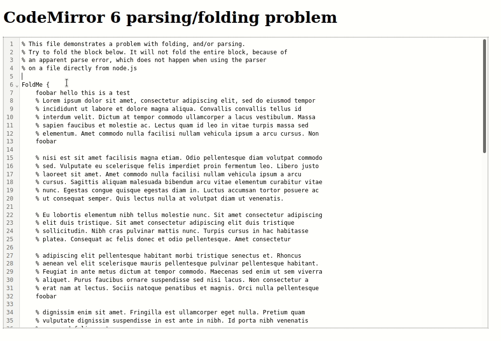

# CM6 parser code-folding problem demo

## The Problem 

At Overleaf, while working on a lezer parser for LaTeX, we stumbled on an apparent bug in the interaction of lezer with code-mirror. This bug manifests when we have a foldable region of the document, which contains a lot of "skip" nodes, such as `Comment` or `Whitespace`. In this case, when we click on the fold marker in the gutter, the fold only covers a small region of text, and seems to end at an erroneous syntax error. 

Parsing the same document, with the same lezer parser, from a node process (feeding it the entire document as a string), does not yield any parse errors. Thus, there seems to be a difference in behaviour between those two environments, depending on whether the parser is fed by a single string, or by (presumably) the incremental parsing machinery in CodeMirror.

Here is a demonstration in gif format:


For example, say we have a function body containing lots of comments:

```
foo() {
  x = 1;
  // bar
  // baz
  // quux
  <and so on for a few hundred lines>
  return true;
}
```

Trying to fold the `foo` function would not fold the entire function body. It would instead stop at an error marker at some arbitrary point in the middle of the function.

(Note: in our specific case, this problem manifested with large LaTeX environments, like `\begin{document}...\end{document}`, containing lots of comment lines, which is fairly normal for realistic LaTeX code. However, the bug is evident in other similar constructs like brace-delimited blocks, or xml tags, and so on.)


### Hypothesis

It seems that the parser is getting tripped up on having so many "skip" nodes, and giving up with an incomplete parse tree. The `foldInside` prop then cannot accurately fold the contents of the function body, leading to the observed behaviour.


### Minimal Reproduction

In this repository, I have created a minimal reproduction of the issue, using a simple grammar for a `problem` language.

See the later instructions on how to run the parser on the command line, and how to run a CodeMirror editor with the parser loaded up.


### Debugging

We tried removing the "skip" rule on Comment, and adding Comment to the grammar in places where it could be valid. With this change, the issue with folding disappears, and the parser does not produce any errors. However, this change is not really viable, as it would require adding 'Comment' to every location in the grammar where it could occur.

See `src/lang/problem/no-problem.grammar` for what that looks like, and the following gif for a demonstration:



This work-arould leads me to believe the issue must lie in how either CodeMirror or lezer behaves when working in incremental mode, with a lot of "skip" nodes.


### Other observations

We also observed the following:

- The issue is not triggered when the content of the block is shorter. There seems to be some critical threshold of "skip" nodes at which the issue happens.

- If we scroll around the document, and then try to fold the region, _sometimes_ this leads to the issue not being triggered (although not consistently, in my testing).


## Important files

- `src/lang/problem/problem.grammar`: A minimal grammar which demonstrates the problem
- `src/lang/problem/examples/problem.txt`: An example program in the "problem" language, which triggers the problematic behaviour in a CodeMirror 6 editor
- `src/lang/problem/lang-problem.ts`: A language module which uses the grammar
- `src/editor.ts`: A CodeMirror 6 editor, loading the "problem" language
- `src/run.ts`: A helper script to run the "problem" parser against a provided file, and print the resulting tree to the terminal


## Running the Code 

To run the parser on the example file, and print the resulting tree in the terminal:

``` sh
npm run demo src/lang/problem/examples/problem.txt
```

To start a web page with with the example text in an CodeMirror editor:

``` sh
npm run generate:problem && npm run build && npm run start
```


